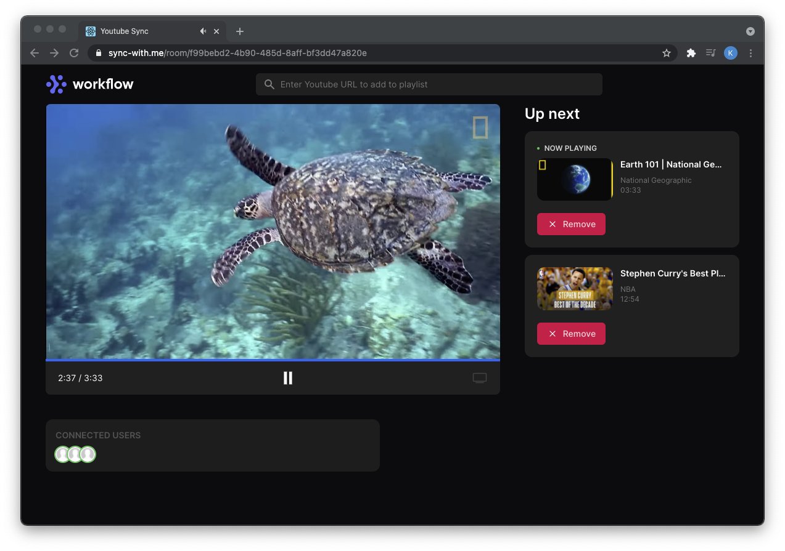

# <h1 style="text-align: center"> Youtube Sync</h1>
A web app written in React/Redux and Go, aimed to sync Youtube videos between users. Deployed with Kubernetes and running on a cluster of Raspberry Pis.



## Setup kubernetes to deploy project locally to single node kubernetes cluster (using `Minikube`)

1. Run Docker Desktop.
2. Use `minikube start` to deploy single node cluster locally on your computer.
3. We will need to change the configuration for minikube to support ingress (ingress-nginx controller) which enables public access to our containers:

    ```
    $ minikube config set vm-driver hyperkit
    $ minikube delete
    $ minikube start
    $ minikube addons enable ingress
    ```

## Setup kubernetes to deploy project to cluster hosted on AWS (using `kubeadm`)

For this project we will deploy a kubernetes cluster with only one node (that node being the master, control-plane).

0. Create an AWS EC2 instance (Ubuntu 18.04) that has at least 2 CPUs, and 2GB memory. This is the minimum specs required for the master node.

1. Follow this [setup guide](https://www.howtoforge.com/setup-a-kubernetes-cluster-on-aws-ec2-instance-ubuntu-using-kubeadm/) which covers the installation of docker, kubernetes, `kubeadm` and setup of a basic kubernetes cluster.

2. Git clone this project to the EC2 server, and create a config map directory which holds all environment variables.

3. 

## How to deploy project 
1. Since our api server docker image is hosted on a private registry on Docker Hub, we need to create a secret for authentication (refer to `deployments/backend-deployment.yaml` `imagePullSecrets`) We will name our secret `regcred`:

    ```
    $ kubectl create secret docker-registry regcred --docker-server=<your-registry-server> --docker-username=<your-name> --docker-password=<your-pword> --docker-email=<your-email>
    ```
    
    Where:
    
    `<your-registry-server>` is your Private Docker Registry FQDN. Use https://index.docker.io/v2/ for DockerHub.
    
2. All environment variables have been stored in ConfigMaps which are then used in our deployment `.yaml` files. They must first be created:

    ```
    # At root folder
    $ kubectl create -f configMaps
    ```

3. Now we can begin deployment of our containers and services:

    ```
    # Run this in root folder which will run all .yaml files in deployments folder
    $ kubectl apply -f deployments
    ```

4. View the status of all pods, services and deployments:
    
    ```
    $ kubectl get all
    ```

5. Once successfully deployed, you can access it locally:
    
    ```
    $ minikube ip
    ```
    This will return an external IP address that you can paste in your browser.

#### Cleaning Up

It is important to clean up the resources you have deployed:
```
# At root folder
$ kubectl delete -f deployments
$ minikube delete
``` 

## How to update docker images

When deploying our application to a kubernetes cluster, our `.yaml` files will pull the docker images from our repositories from Docker Hub. To update images:
1. Make sure you are logged into Docker Hub:

    ```
    $ docker login
    ```
2. Build the docker image for either the server or client:

    ```
    $ docker build -t sync-server:v0.0 -f ./build/Dockerfile .
    ```

    - The `-t` argument tags the image. By convention, the label after the colon is used to specify the image version.

    - The `-f` argument specifies the path of the Dockerfile which can be useful if the dockerfile is not stored in the root folder of the application but you want the context to be at the root.

    This build will be saved locally.

3. Tag the image to prepare for it to be pushed to the repository:

    ```
    $ docker image tag sync-server:v0.0 <YOUR-DOCKER-ID>/sync-server:v0.0
    ```
4. Push to the repository:
    
    ```
    $ docker image push <YOUR-DOCKER-ID>/sync-server:v0.0
    ```
